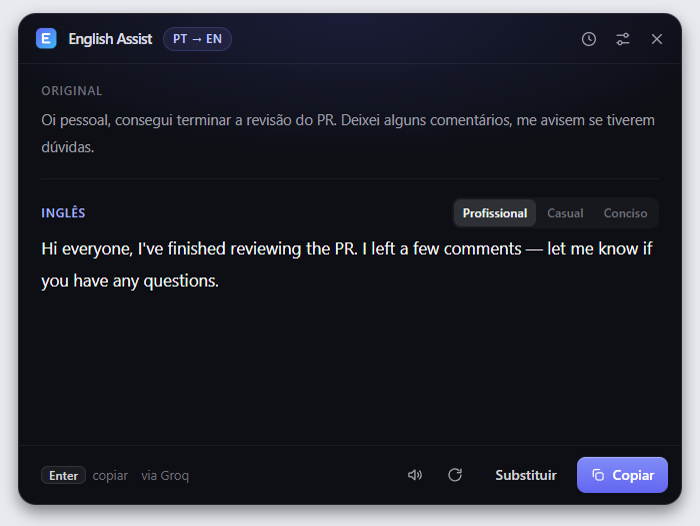

# English Assist

Assistente de escrita em inglês que vive na bandeja do Windows. Copie um texto, pressione `Ctrl+Alt+E` e receba a versão em inglês numa janela flutuante, pronta para colar.

- **Texto em português** → traduzido para um inglês nativo e profissional.
- **Texto em inglês** → gramática corrigida e reescrito para soar mais natural.



## Como funciona no dia a dia

1. Deixe o app rodando em segundo plano (ele fica só na bandeja do sistema, sem janela na barra de tarefas).
2. Escreva seu e-mail, mensagem de Slack ou comentário de PR, selecione o texto e pressione `Ctrl+C`.
3. Pressione `Ctrl+Alt+E`. A janela aparece e o texto em inglês vai sendo escrito em tempo real.
4. Pressione `Enter` para copiar o resultado. A janela se fecha sozinha e você cola com `Ctrl+V`.

| Atalho       | Ação                                                   |
| ------------ | ------------------------------------------------------ |
| `Ctrl+Alt+E` | Global: lê o clipboard e abre a janela com o resultado |
| `Enter`      | Copia o resultado e fecha a janela                     |
| `Ctrl+R`     | Refaz o texto (gera outra versão)                      |
| `Esc`        | Fecha a janela                                         |

Clicar fora da janela também a fecha. O ícone na bandeja tem um menu com **Melhorar texto copiado**, **Abrir janela**, **Configurações…**, **Iniciar com o Windows** e **Sair**.

## Requisitos

- Windows 10 ou 11 (64 bits)
- [Node.js](https://nodejs.org) 20 ou superior
- Uma chave de API de algum provedor de IA. Há [opções gratuitas](#usando-de-graça); a OpenAI é paga

## Instalação

```bash
git clone https://github.com/wallaceluis/english-writing-assistant.git
cd english-writing-assistant
npm install
npm run dev
```

O `npm run dev` abre o app com hot reload. Use `F12` com a janela em foco para abrir o DevTools.

## Configurando o provedor de IA

Na primeira execução o app abre direto na tela de configurações. Depois disso, ela fica no menu da bandeja (**Configurações…**) e no ícone de ajustes no topo da janela.

1. Escolha um provedor na lista.
2. Clique em **Criar uma chave ↗**, gere a chave no site do provedor e cole no campo **Chave de API**.
3. Clique em **Ativar**.

Cada chave é criptografada com a [`safeStorage`](https://www.electronjs.org/docs/latest/api/safe-storage) do Electron (DPAPI do Windows, vinculada ao seu usuário) e gravada em `%APPDATA%\English Assist\settings.json`. Ela nunca chega ao processo de renderização: a interface só fica sabendo se existe uma chave e quais são os quatro últimos caracteres.

Todos os provedores são acessados pelo formato Chat Completions da OpenAI, então o campo **Modelo** aceita qualquer ID de modelo de chat daquele provedor.

### Usando de graça

Assinaturas do ChatGPT e do Claude não dão acesso à API, e não existe login oficial que permita a um app de terceiros usar a assinatura. O caminho gratuito são os planos grátis das APIs abaixo, que não pedem cartão de crédito.

| Provedor       | Modelo padrão         | Limites do plano gratuito                                              | Observações                                                                |
| -------------- | --------------------- | ---------------------------------------------------------------------- | -------------------------------------------------------------------------- |
| Google Gemini  | `gemini-3.8-flash`    | Variam por modelo; veja em [AI Studio](https://aistudio.google.com/rate-limit) | O Google pode usar os textos do plano grátis para melhorar seus produtos   |
| Groq           | `openai/gpt-oss-120b` | 30 requisições/min, 1.000/dia e 200 mil tokens/dia por modelo          | O mais rápido; o limite diário de tokens acaba antes do de requisições     |
| OpenRouter     | `openrouter/free`     | 20 requisições/min e 50/dia (1.000/dia após comprar US$ 10 em créditos) | Uma chave para vários modelos `:free`; a lista de modelos grátis muda      |
| Ollama (local) | `llama3.2`            | Sem limites                                                            | Roda no seu PC e nada sai da máquina; a qualidade depende do modelo e da GPU |

Os números são de outubro de 2026 e mudam com frequência. Um texto típico de e-mail ou Slack gasta poucas centenas de tokens, então qualquer um desses planos cobre o uso diário de uma pessoa.

Para o Ollama, instale em [ollama.com](https://ollama.com), baixe um modelo com `ollama pull llama3.2` e ative o provedor no app (não precisa de chave).

Em **Outro compatível** entra qualquer API no mesmo formato: informe a URL base, o modelo e a chave. Serve para Cerebras, Mistral, a API da Meta (Muse Spark, que dá créditos iniciais mas não tem plano gratuito permanente) ou LM Studio. Por segurança, só são aceitas URLs `https://`, ou `http://` quando o servidor está em `localhost`.

### Fallback automático

Ative mais de um provedor e eles formam uma fila, na ordem mostrada na tela de configurações (as setas mudam a ordem). O primeiro responde; se ele falhar por qualquer motivo (limite atingido, cota esgotada, chave inválida, modelo fora do ar, sem conexão), o app tenta o seguinte sem você fazer nada. Quando isso acontece, a janela mostra `fallback · via <provedor>` ao lado do resultado.

Uma combinação que funciona bem sem gastar nada: **Groq** em primeiro (rápido), **Gemini** em segundo e **Ollama** por último, para continuar funcionando sem internet.

Detalhes do comportamento:

- Só o último provedor da fila repete a tentativa em caso de limite ou erro do servidor; os anteriores passam a vez imediatamente.
- Se um provedor falhar no meio da resposta, o texto parcial é descartado e o seguinte recomeça do zero.
- Cada requisição tem tempo limite de 30 segundos.
- Se todos falharem, a janela mostra o erro do último.

### Por variável de ambiente

Útil em desenvolvimento. Copie `.env.example` para `.env` na raiz do projeto e preencha as chaves que quiser:

```ini
OPENAI_API_KEY=
GEMINI_API_KEY=
GROQ_API_KEY=
OPENROUTER_API_KEY=
```

O arquivo `.env` só é lido fora do app instalado (`npm run dev` e `npm start`) e está no `.gitignore`. No app instalado, as mesmas variáveis definidas no Windows também são respeitadas. Uma chave salva pelo app tem prioridade sobre a do ambiente.

## Compilando para Windows

```bash
npm run dist
```

O instalador é gerado em `release/English-Assist-Setup-1.0.0.exe` (NSIS, x64). Para testar sem instalar, `npm run dist:dir` gera apenas a pasta `release/win-unpacked/` com o `English Assist.exe`.

Depois de instalar, marque **Iniciar com o Windows** no menu da bandeja para o app subir junto com o sistema.

> O executável não é assinado digitalmente, então o Windows SmartScreen pode avisar na primeira execução. Clique em **Mais informações → Executar assim mesmo**.

### Erro "Cannot create symbolic link" no `npm run dist`

O electron-builder baixa um pacote (`winCodeSign`) que contém links simbólicos, e o Windows só permite criá-los com privilégio. Resolva de uma destas formas e rode o comando de novo:

- Ative o **Modo de Desenvolvedor** em *Configurações → Privacidade e segurança → Para desenvolvedores*; ou
- Abra o terminal como **Administrador** só para a primeira compilação (o pacote fica em cache).

## Scripts

| Script              | O que faz                                                      |
| ------------------- | -------------------------------------------------------------- |
| `npm run dev`       | Roda o app em desenvolvimento com hot reload                   |
| `npm run build`     | Checa os tipos e compila main, preload e renderer para `out/`  |
| `npm start`         | Roda a versão compilada de `out/`                              |
| `npm run typecheck` | Só a checagem de tipos do TypeScript                           |
| `npm run dist`      | Compila e gera o instalador do Windows em `release/`           |
| `npm run dist:dir`  | Compila e gera só a pasta descompactada, sem instalador        |
| `npm run icons`     | Redesenha `resources/icon.png` e `resources/tray.png`          |

## Arquitetura

```
src/
├── main/                 Processo principal do Electron
│   ├── index.ts          Inicialização, instância única, primeira execução
│   ├── window.ts         Janela flutuante sem bordas (mostrar, esconder, posicionar)
│   ├── tray.ts           Ícone e menu da bandeja
│   ├── shortcut.ts       Registro do atalho global
│   ├── assistant.ts      Sessão: lê o clipboard, percorre os provedores, emite eventos
│   ├── openai.ts         Cliente, prompt, streaming e tradução dos erros da API
│   ├── settings.ts       Provedores, chaves criptografadas e ordem de fallback
│   └── ipc.ts            Handlers das chamadas vindas do renderer
├── preload/index.ts      Ponte segura (contextBridge) exposta como window.api
├── renderer/             Interface em React + Tailwind CSS
│   └── src/
│       ├── App.tsx
│       ├── hooks/useAssistant.ts
│       └── components/
└── shared/
    ├── ipc.ts            Canais e tipos compartilhados entre os três processos
    └── providers.ts      Catálogo de provedores (URL base, modelo padrão, limites)
```

O fluxo de um atalho:

1. O `globalShortcut` dispara no processo principal, que lê o texto do clipboard e mostra a janela.
2. O principal chama a API de Chat Completions do primeiro provedor ativo com `stream: true`; se falhar, tenta o seguinte.
3. Cada pedaço da resposta vai para o renderer pelo canal `session:event` (`start`, `provider`, `mode`, `delta`, `done` ou `error`).
4. O renderer só desenha o estado. Copiar, fechar e refazer voltam ao principal por `ipcRenderer.invoke`.

O renderer roda com `contextIsolation`, `sandbox` e sem `nodeIntegration`; as chaves e todas as chamadas de rede ficam no processo principal.

## Privacidade

O texto copiado é enviado à API do provedor ativo (e do seguinte, se houver fallback) somente quando você pressiona o atalho (ou usa **Melhorar texto copiado** / **Refazer**). O app não monitora o clipboard, não guarda histórico e não envia dados para nenhum outro serviço. Cada provedor tem sua própria política: no plano gratuito do Gemini, por exemplo, o Google pode usar os textos para melhorar seus produtos. Com o Ollama, nada sai do seu computador.

## Problemas comuns

| Sintoma                                           | O que fazer                                                                                                                                                 |
| ------------------------------------------------- | ----------------------------------------------------------------------------------------------------------------------------------------------------------- |
| Aviso "Atalho indisponível" ao abrir              | Outro programa já usa `Ctrl+Alt+E`. Feche-o ou troque a constante `SHORTCUT` em `src/main/shortcut.ts`.                                                     |
| `AltGr+E` parou de digitar `°`                    | No Windows, `AltGr` equivale a `Ctrl+Alt`, então o atalho captura essa combinação enquanto o app está aberto. Troque o atalho em `src/main/shortcut.ts`.    |
| "… recusou a chave de API" | A chave está errada ou foi revogada. Gere outra e salve em **Configurações**. |
| "… está sem créditos ou sem cota" | A cota gratuita do dia acabou ou a conta paga está sem saldo. Ative outro provedor como fallback. |
| "… atingiu o limite de requisições" | Limite por minuto do plano gratuito. Espere alguns segundos ou ative um segundo provedor. |
| "O modelo … não existe ou não está disponível" | O ID do modelo mudou ou sua conta não tem acesso a ele. Troque em **Configurações**. |
| "Não encontrei texto no clipboard"                | O clipboard está vazio ou tem uma imagem/arquivo. Copie o texto com `Ctrl+C` antes do atalho.                                                               |
| `npm install` falha ao instalar o Electron        | O projeto fixa o Electron 39, a última série cujo instalador roda no Node 20. Para usar um Electron mais novo, atualize o Node para 22.12 ou superior.      |

## Stack

[Electron](https://www.electronjs.org) · [electron-vite](https://electron-vite.org) · [React](https://react.dev) · [TypeScript](https://www.typescriptlang.org) · [Tailwind CSS](https://tailwindcss.com) · [OpenAI Node SDK](https://github.com/openai/openai-node) · [electron-builder](https://www.electron.build)

## Licença

[MIT](LICENSE)
